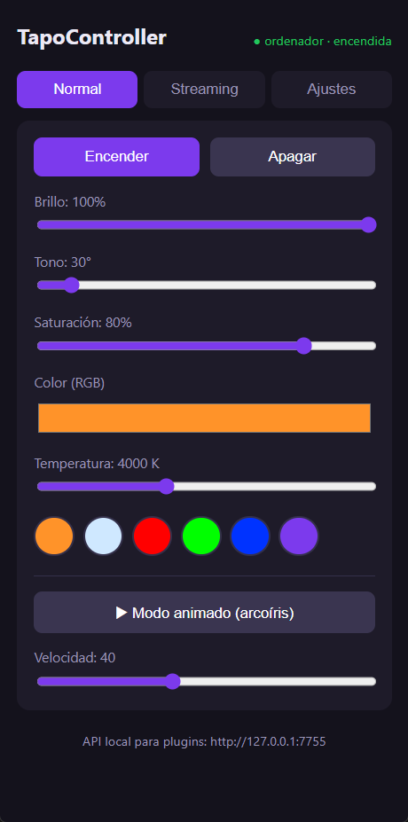
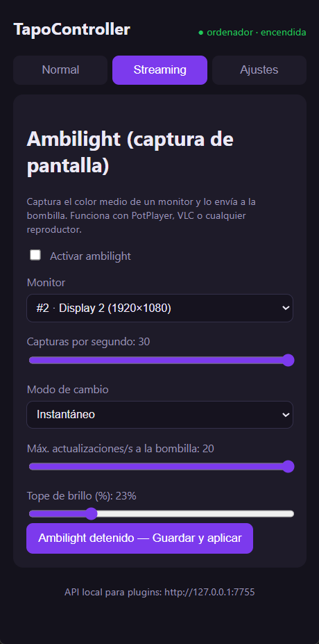

# TapoController

**100% local control (no cloud) of a TP‑Link Tapo L530 smart bulb** — desktop
app (Tauri 2 + React) with an own, reverse‑engineered implementation of the
Tapo local protocol (KLAP), a smooth on‑device animated mode, a screen‑capture
**Ambilight** that works with PotPlayer/VLC/anything, and a local API for
plugins.

No third‑party SDK and no TP‑Link cloud during operation: every command goes
straight to the bulb on your LAN.

<p align="center">
  
  &nbsp;&nbsp;
  
</p>

---

## The bulb

| | |
|---|---|
| Model | **Tapo L530E** (EU SKU reported by the device: `L530EA`) |
| Type | Smart Wi‑Fi LED bulb, multicolor |
| Socket | E27 |
| Light | White **2500–6500 K** + ~16M colors, dimmable |
| Brightness / power | ≈ 806 lm, ≈ 8.7 W (60 W equivalent) |
| Connectivity | 2.4 GHz Wi‑Fi (802.11 b/g/n), **no hub required** |
| Local protocol | **KLAP** over HTTP (firmware "SHIP 2.0", e.g. `1.4.2`) |
| Matter | ❌ Not supported by the L530 (the L535E is the Matter model) |

Official product page: **<https://www.tapo.com/en/product/smart-light-bulb/tapo-l530e/>**

---

## Download & install

Grab the latest from **[Releases](https://github.com/alexwing/TapoController/releases/latest)**:

| File | Use |
|------|-----|
| `TapoController_*_x64-setup.exe` | NSIS installer (recommended) |
| `TapoController_*_x64_en-US.msi` | MSI installer (deployment/GPO) |
| `TapoController_*_x64_standalone.exe` | Portable, no install — just run it |

> The binaries are **unsigned**, so Windows SmartScreen shows an
> "unknown publisher" warning the first time → *More info* → *Run anyway*.

### One‑time requirement (enforced by the bulb firmware)

Recent L530 firmware ships with the **local API disabled**. Enable it **once**
in the official Tapo mobile app:

> **Me / account icon → Third‑Party Services (a.k.a. "Tapo Lab →
> Third‑Party Compatibility") → ON**

After that, all control is local — no cloud, no internet needed.

### First run

1. Open TapoController → **Settings** tab.
2. Fill in **IP/host**, and the **e‑mail/password of the TP‑Link account the
   bulb is linked to** (used only locally to derive the auth hash — never sent
   to any cloud). Leave **Protocol** on *Auto‑detect*.
3. Press **Save & apply**. Use **Diagnose connection** if something fails:
   - `KlapReady` → good.
   - `KlapGatedOff` → you still need to enable Third‑Party Services (above).
   - `Unreachable` → wrong IP / not on the LAN.
4. Settings are persisted to `%APPDATA%\TapoController\tapo-config.toml`.

Recommended: block the bulb's WAN/internet access on your router (MAC prefix
`3C‑6A‑D2…`) so a cloud re‑bind can't overwrite the local setup.

---

## User manual

The app has three tabs. The header shows the bulb name and on/off state and
auto‑refreshes every 5 s.

### Normal tab


- **Turn on / Turn off**.
- **Brightness** 1–100 %.
- **Hue / Saturation** sliders (apply on release).
- **Color (RGB)** picker — pick any color.
- **Temperature** 2500–6500 K (warm ↔ cool white).
- **Presets** — quick color swatches.
- **Animated mode (rainbow)** — a smooth color cycle rendered **by the bulb
  itself** (its native dynamic‑effect engine, like the Tapo app: no flicker,
  no per‑frame network traffic). **Speed** slider sets the fade time.

### Streaming tab — Ambilight


Captures the average color of a monitor and pushes it to the bulb, so the light
matches what's on screen. Player‑agnostic — works with **PotPlayer**, VLC,
browsers, games, anything.

1. Pick the **Monitor** (multi‑display supported — choose Display 1, 2, …).
2. Set **Captures per second** (1–30).
3. **Change mode**:
   - **Fade (smooth)** — eased transitions; set the **Fade smoothness**.
   - **Instant** — snap to the screen color.
4. **Max bulb updates/s** — caps how often the bulb is updated (LAN/KLAP
   latency is ~30–150 ms, so realistic sustained rate is ~5–15 Hz; the pipeline
   coalesces and rate‑limits so the bulb is never flooded).
5. **Brightness cap (%)** — the bulb brightness tracks the scene luminance but
   never exceeds this ceiling (dark scene → dim, bright scene → up to the cap).
6. Tick **Enable ambilight** (or press the button) to start/stop. Settings are
   saved and applied live.

> Tip for PotPlayer: play the video full‑screen on the selected monitor and
> set mode to *Fade* with a medium smoothness for a relaxed backlight, or
> *Instant* at higher fps for a punchier effect.

### Settings tab

- **Connection**: host, account user/password, protocol, **Diagnose**.
- **Local API**: enable/disable the embedded server, bind address and port.
- **Language**: *System* (auto‑detect), *Spanish* or *English*.
- **Save & apply** persists everything (changing API port/bind needs an app
  restart).

### System tray (Windows)

Closing or minimizing the window sends the app to the **tray** (it keeps
running — API and ambilight included). Tray menu: **Turn on · Turn off ·
Show/Hide · Exit**. Left‑click the tray icon toggles the window.

---

## Local API (for plugins)

With the app running, an HTTP + WebSocket server is available (default
`http://127.0.0.1:7755`). Endpoints: `/health`, `/monitors`, `/state`,
`/power`, `/brightness`, `/color`, `/color_temp`, `/animation`, and a
WebSocket `/stream` for high‑rate color frames.

Full spec and examples: **[`docs/API.md`](docs/API.md)** ·
sample client: [`examples/ambilight-demo.mjs`](examples/ambilight-demo.mjs).

```sh
curl http://127.0.0.1:7755/health
curl -X POST http://127.0.0.1:7755/power -H 'Content-Type: application/json' -d '{"on":true}'
```

---

## Build from source

Requirements: Rust (stable), Node 18+, and the Tauri prerequisites for your OS.

```sh
npm install
npm run tauri dev      # run in development
npm run tauri build    # produce installers + standalone exe
cargo test --workspace # run the test suite
```

Project layout:

```
crates/tapo-proto/   Core: own protocol (KLAP + legacy securePassthrough),
                     config, ControlService (session, reconnect, color
                     pipeline, animation), diagnostics.
crates/tapo-cli/     Diagnostic CLI (doctor / info / set / raw …).
src-tauri/           Desktop app: IPC, tray, embedded API server, ambilight.
src/                 React/Vite/TypeScript UI (3 tabs + i18n).
docs/                API spec + screenshots.
scripts/             GitHub release helper.
```

## How it works (reverse‑engineering notes)

- The bulb's embedded **"SHIP 2.0" HTTP server is case‑sensitive on header
  names** and rejects the lowercase headers `hyper`/`reqwest` emit, so
  `tapo-proto` ships its **own raw HTTP/1.1 client** (`http.rs`) with
  Title‑Case headers and `Content-Length`‑delimited reads.
- Protocol is **KLAP**; `handshake1` needs a random seed and the credential
  hash for this firmware is `sha256( sha1(user) ‖ sha1(pass) )` (auto‑resolved
  against the server hash among known schemes).
- The smooth rainbow uses the bulb's `edit_dynamic_light_effect_rule` +
  `set_dynamic_light_effect_rule_enable` (rule "L1", `change_mode: "bln"`,
  exactly 8 color stops) — the firmware does the fades.

## License

MIT.
